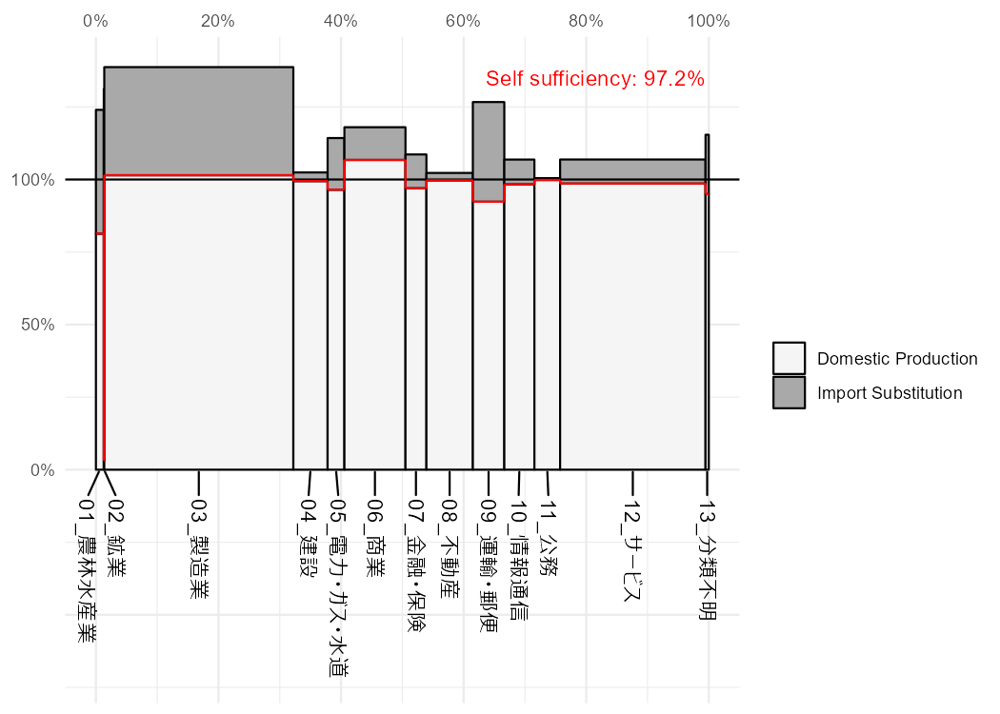

<!-- README.md is generated from README.Rmd. Please edit that file -->

# jpio

<!-- badges: start -->
<!-- badges: end -->

jpio is an R package for input-output analysis.

## Installation

You can install the development version of jpio from
[GitHub](https://github.com/) with:

``` r
# install.packages("devtools")
devtools::install_github("UchidaMizuki/jpio")
```

``` r
library(jpio)

iotable_sector13_2011
#> # A dibble:   437
#> # Dimensions: input [19], output [23]
#>    input$type $name         output$type $name                     .
#>    <fct>      <chr>         <fct>       <chr>                 <dbl>
#>  1 industry   01_農林水産業 industry    01_農林水産業       1456611
#>  2 industry   01_農林水産業 industry    02_鉱業                  75
#>  3 industry   01_農林水産業 industry    03_製造業           7793613
#>  4 industry   01_農林水産業 industry    04_建設               56940
#>  5 industry   01_農林水産業 industry    05_電力・ガス・水道       0
#>  6 industry   01_農林水産業 industry    06_商業                8759
#>  7 industry   01_農林水産業 industry    07_金融・保険             0
#>  8 industry   01_農林水産業 industry    08_不動産               176
#>  9 industry   01_農林水産業 industry    09_運輸・郵便          2137
#> 10 industry   01_農林水産業 industry    10_情報通信               0
#> # … with 427 more rows
skyline(iotable_sector13_2011)
```


